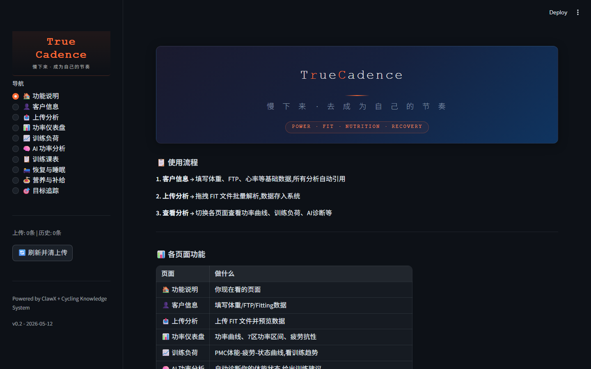
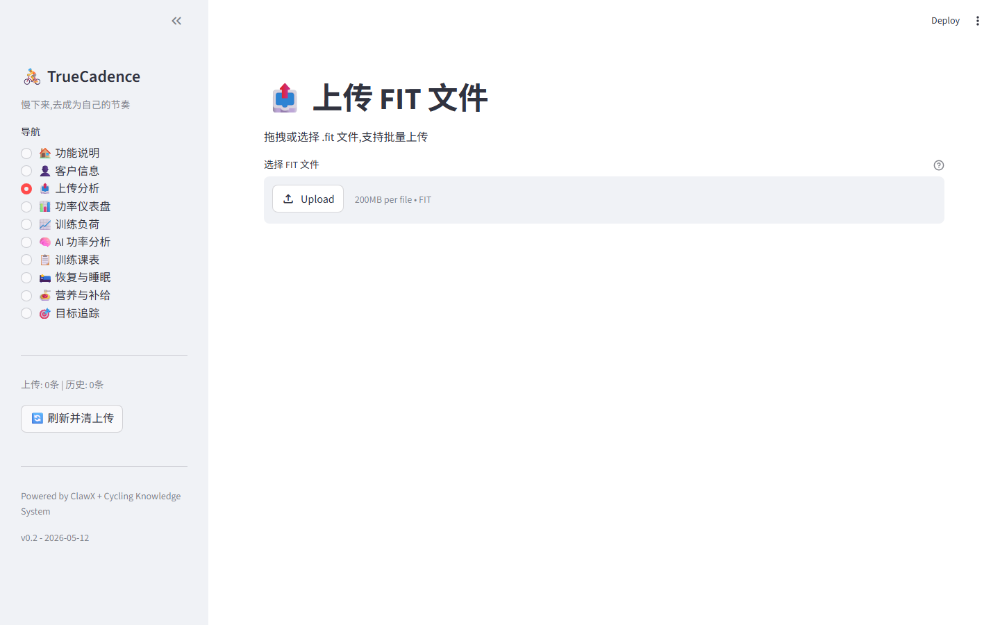
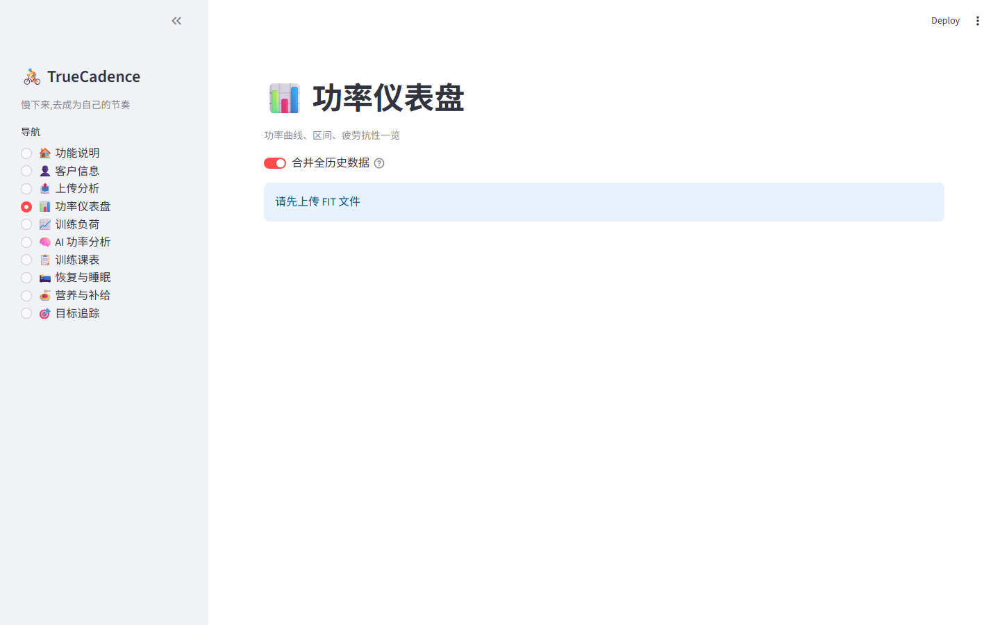
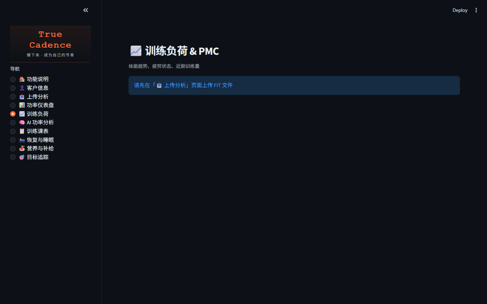
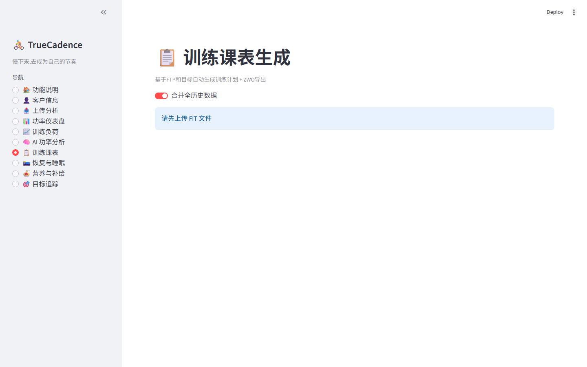
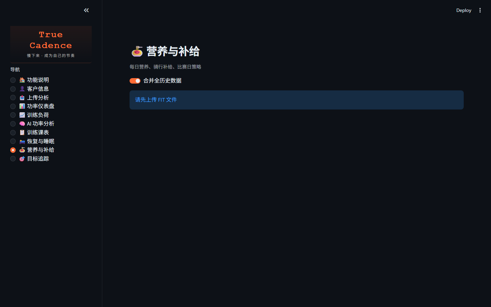

# TrueCadence Power Training

TrueCadence is a cycling power-training web app for riders and coaches. It turns FIT ride files, FTP, power curves, training load, recovery feedback and event context into practical training analysis, weekly plans and workout files.

> The project is built for training support and data analysis. It is not a medical diagnosis tool.

## Highlights

- **FIT upload and ride analysis**: parse cycling FIT files and summarize distance, duration, power, heart rate and cadence.
- **Power profile**: estimate best-power windows such as 5s, 1min, 5min, 20min, 40min and 60min.
- **FTP and training zones**: support rider-entered FTP and conservative FTP evidence checks.
- **Training load / PMC**: CTL, ATL, TSB-style load interpretation for readiness and progression.
- **Automatic training plan rules**:
  - Stage A: conflict-prevention and safety gates.
  - Stage B: conservative MMP / matchbook / VO2 / TTE focus.
  - Stage C: cadence, torque and pain-safety layer.
  - Stage D: event date, countdown and race-specific strategy layer.
- **Workout export**: generate `.zwo`, `.erg` and `.mrc` files. ZWO export is structured for better Intervals.icu / Zwift compatibility.
- **Recovery and nutrition pages**: support rider feedback, sleep/recovery context and fueling guidance.
- **Server-ready deployment**: Streamlit app with Ubuntu deployment notes.

## Screenshots

| Home | Upload analysis | Power dashboard |
| --- | --- | --- |
|  |  |  |

| Training load | Training plan | Nutrition |
| --- | --- | --- |
|  |  |  |

## Quick start

### 1. Clone

```bash
git clone git@github.com:H3E3/truecadence-power-training.git
cd truecadence-power-training
```

If the repository has not been renamed yet, use the current remote URL instead.

### 2. Create environment

The app uses Python 3.11+.

```bash
python3 -m venv .venv
source .venv/bin/activate
pip install -r requirements.txt
```

### 3. Run locally

```bash
TRUECADENCE_DEPLOY_MODE=local streamlit run app.py --server.port 8502 --server.address 127.0.0.1
```

Open:

```text
http://127.0.0.1:8502/
```

### 4. Server mode

For Ubuntu deployment, see:

- [`deploy_ubuntu.md`](deploy_ubuntu.md)
- [`docs/production_json_safety.md`](docs/production_json_safety.md)

A typical server deployment uses:

```bash
TRUECADENCE_DEPLOY_MODE=server
TRUECADENCE_DATA_DIR=/opt/truecadence/data
TRUECADENCE_TMP_DIR=/opt/truecadence/tmp_uploads
TRUECADENCE_ASSET_DIR=/opt/truecadence/assets
```

See `.env.example` for environment examples.

## Project structure

Core Streamlit entry and page modules:

- `app.py` — runtime shell: app setup, auth/session context, navigation and page dispatch.
- `tc_pages/` — page UI modules. Formal page-level UI work should happen here instead of growing `app.py` again.
- `ui_components.py` — shared UI components used across pages.
- `services/` — data parsing, storage and integration helpers.
- `rules/` and `training_plan_rules.py` — training, recovery and nutrition rules.

The legacy root `pages/` directory was removed after the Stage-J page split. Use `tc_pages/` for page modules to avoid Streamlit legacy multipage auto-discovery confusion.

## Verification

Run syntax and rule checks before deployment:

```bash
python -m py_compile app.py tc_pages/*.py
python verify_workout_exports.py
python verify_training_rules_bridge.py
python verify_training_e1_regression.py
python verify_training_stage_f.py
python verify_feedback_delete.py
python verify_fit_processing.py
python verify_recovery_nutrition_rules.py
python tests/test_fit_parser_regression.py
```

Expected output currently includes:

```text
OK 18 Stage-A/B/C/D bridge checks passed
OK 9 Stage-E1 regression checks passed
OK 6 Stage-F progression checks passed
OK feedback delete/clear fallback guard verified
OK fit_processing smoke checks passed
OK recovery/nutrition Stage-H checks passed
All 3 FIT sample(s) parsed successfully.
```

## Workout export

The training-plan page can export:

- `.zwo` for Zwift / Intervals.icu
- `.erg` as Intervals.icu-compatible backup
- `.mrc` as another percentage-based backup format

Long steady rides are split into multiple blocks with warmup and cooldown to avoid single huge steady-state files that some importers reject.

## Repository hygiene

Runtime and private data should not be committed:

- `.env`, `.streamlit/secrets.toml`
- `data/`, `tmp_uploads/`, `backups/`
- FIT / GPX / TCX files
- user databases, invitation codes, activation files
- local app snapshots and backup files

See `.gitignore` for details.

## License

This repository is released under the MIT License. See [`LICENSE`](LICENSE).
